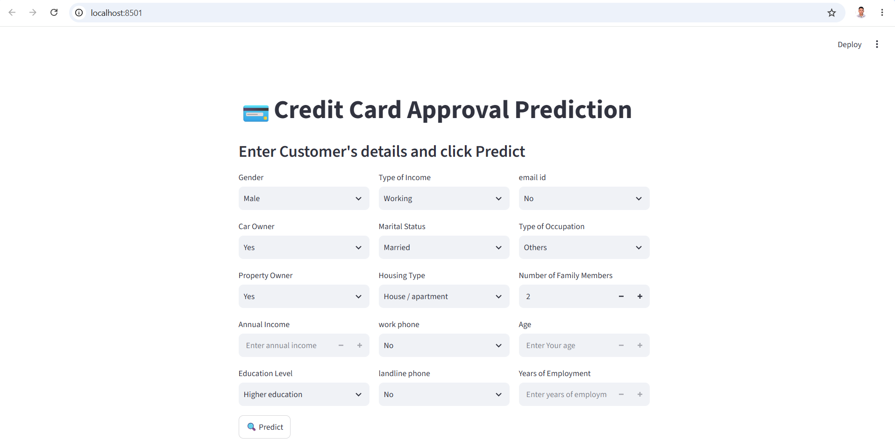
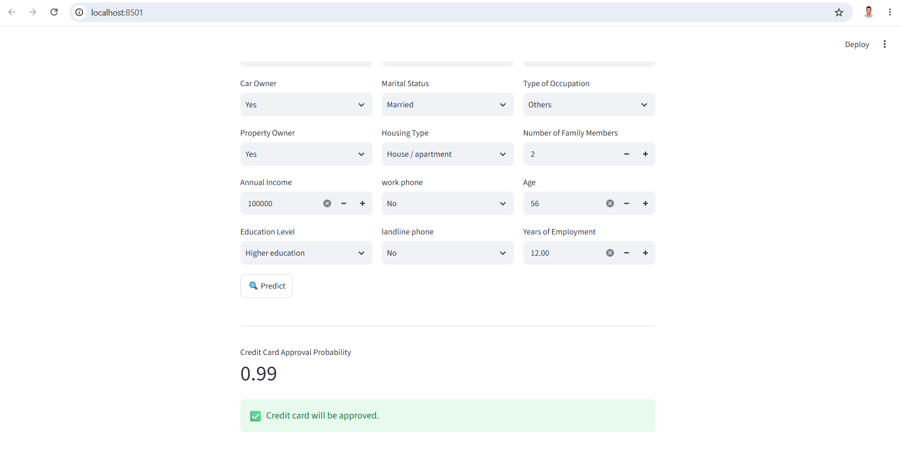

# 💳 Credit Card Approval Prediction

## 📌 Project Overview
Commercial banks receive countless applications for credit cards every day. Many of these get rejected for various reasons, such as high loan balances, low income levels, or too many inquiries on an individual's credit report. Manually analyzing these applications is mundane, error-prone, and time-consuming. 

This project aims to automate the credit card approval process using Machine Learning techniques. By analyzing applicant details (e.g., income, employment status, family status, age), we build a predictive classification model that determines whether an applicant is a "good" or "bad" candidate for a credit card.

## 🎯 Objective
To build a robust Machine Learning classification model that accurately predicts credit card approval based on historical customer data and financial behavioral patterns.

## 📊 Dataset
The project relies on standard credit card application data (commonly sourced from Kaggle  https://www.kaggle.com/datasets/rohitudageri/credit-card-details/). The data generally consists of two main tables:
1. **Application Data:** Contains personal and socio-economic details of the applicants (e.g., Gender, Income, Education, Family Status, Housing Type).
2. **Credit Record Data:** Contains the historical credit behavior of the users (e.g., months past due, loan status) which helps in creating the target variable (Approved/Rejected).

## 🛠️ Technologies & Libraries Used
- **Programming Language:** Python
- **Data Manipulation:** Pandas, NumPy
- **Data Visualization:** Matplotlib, Seaborn
- **Machine Learning:** Scikit-Learn (Logistic Regression, Random Forest, XGBoost, Support Vector Machines)
- **Environment:** Jupyter Notebook / IDE of choice

## ⚙️ Project Pipeline
1. **Data Preprocessing & Cleaning:** Handling missing values, removing duplicates, and dealing with outliers.
2. **Exploratory Data Analysis (EDA):** Visualizing distributions and relationships between features (e.g., income vs. approval rate).
3. **Feature Engineering:** Encoding categorical variables (One-Hot Encoding, Label Encoding), feature scaling, and resolving class imbalance using techniques like SMOTE.
4. **Model Building:** Training various classification algorithms.
5. **Model Evaluation:** Testing models using metrics like Accuracy, Precision, Recall, F1-Score, and ROC-AUC curve.
6. **Hyperparameter Tuning:** Optimizing the best-performing model to achieve higher accuracy.

## 🚀 How to Run the Project

1. **Clone the repository:**
   ```bash
   git clone [https://github.com/Abhishek98negi/Credit-Card-Approval-Prediction.git](https://github.com/Abhishek98negi/Credit-Card-Approval-Prediction.git)
   cd Credit-Card-Approval-Prediction

2. **Create a Virtual Environment (Optional but recommended):**
    ```bash
    python -m venv env
    source env/bin/activate  # On Windows use: env\Scripts\activate

3. **Install required dependencies:**
    ```bash
    pip install -r requirements.txt
    (Note: If requirements.txt is not present, simply install pandas, numpy, matplotlib, seaborn, scikit-learn, joblib, fastapi, pydantic, and streamlit via pip).


## ▶️ Run the Application

```bash
uvicorn backend.main:app --reload
```

```bash
streamlit run frontend/app.py
```

Open your browser and visit

```
http://localhost:8501
```

---
📈 Results & Evaluation

The dataset suffered from class imbalance, which was handled appropriately before training.

Several models were tested (Logistic Regression, Decision Trees, Random Forest).

Random Forest / XGBoost generally outperformed other models, yielding the best ROC-AUC score and correctly identifying high-risk applicants while minimizing false positives.

---
📷 Screenshots

